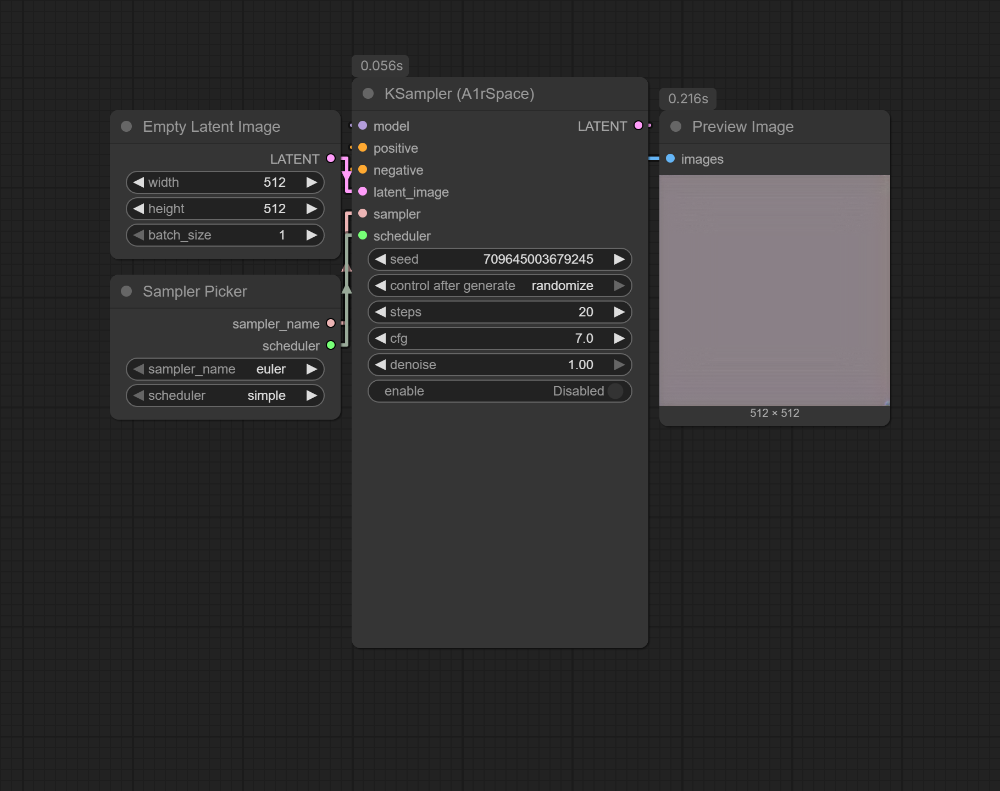
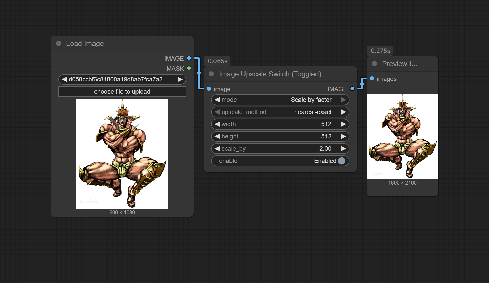
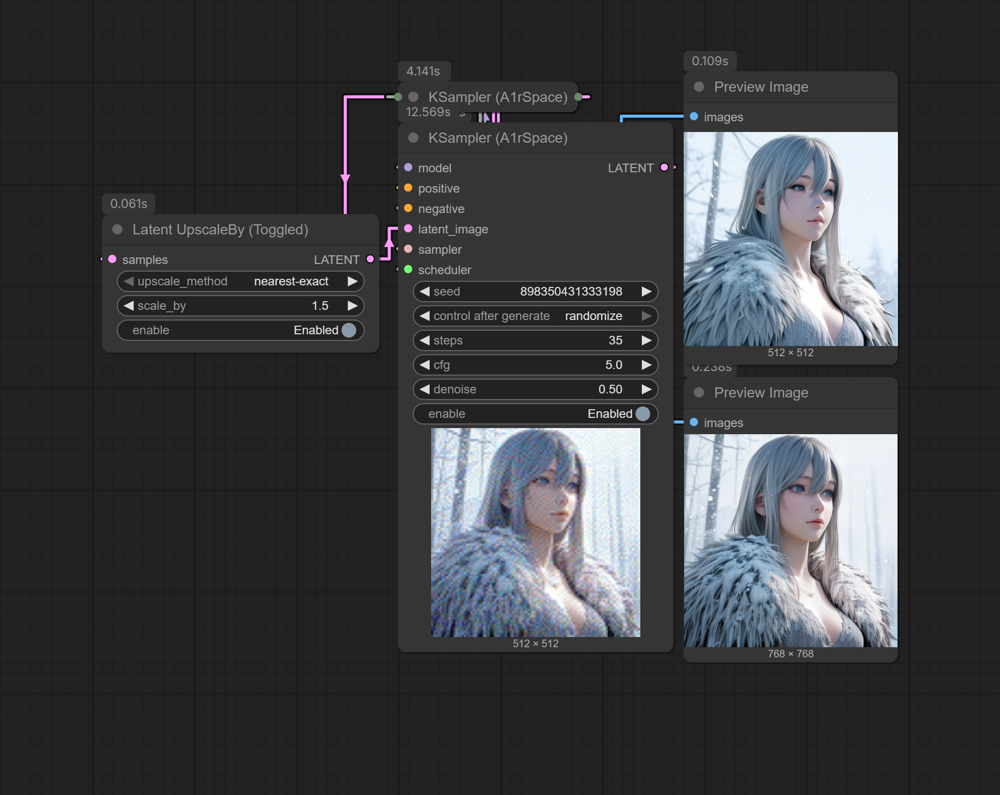
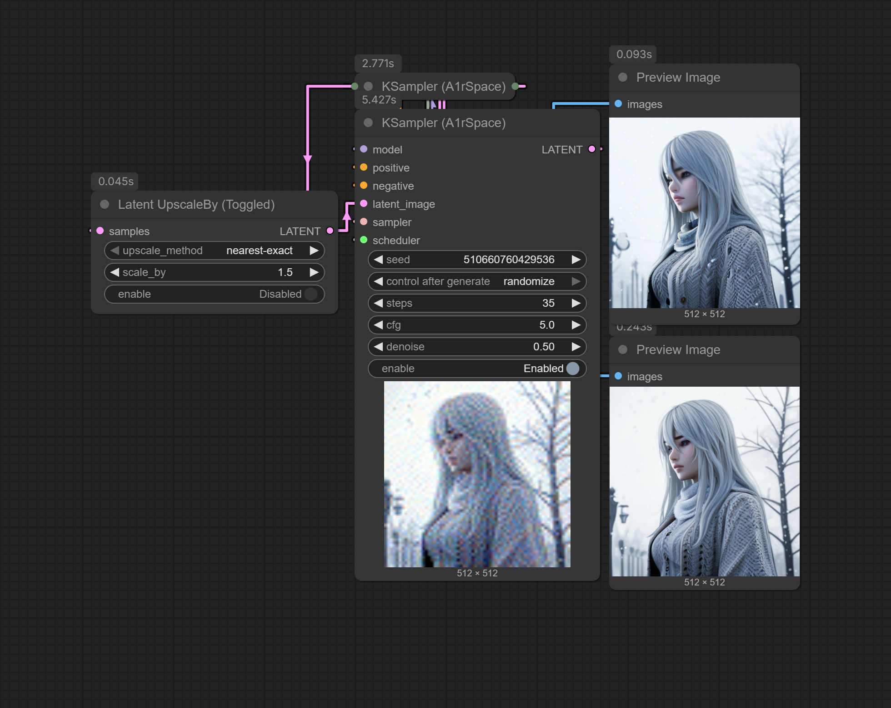
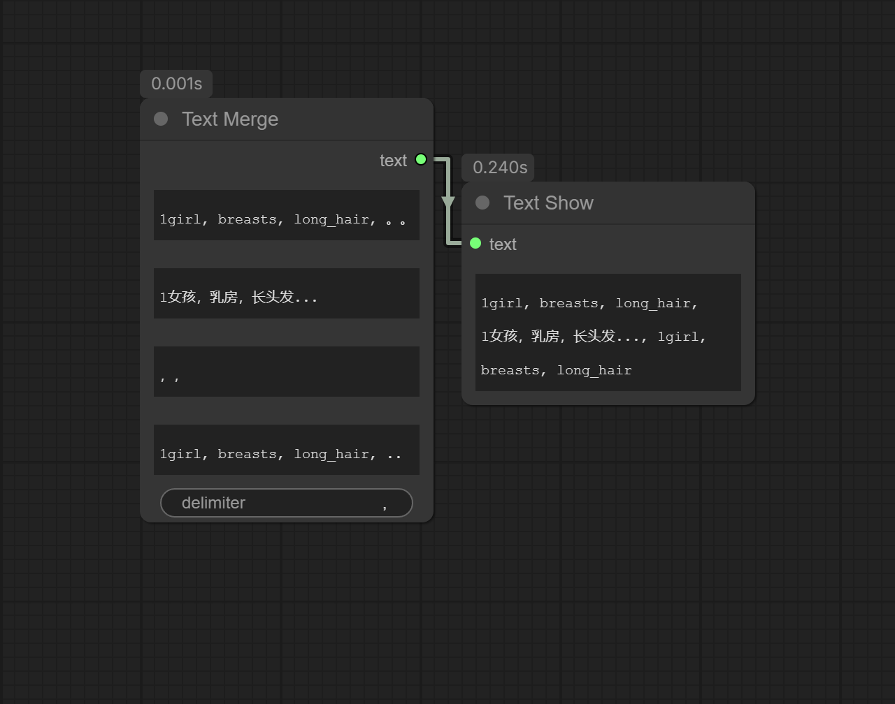
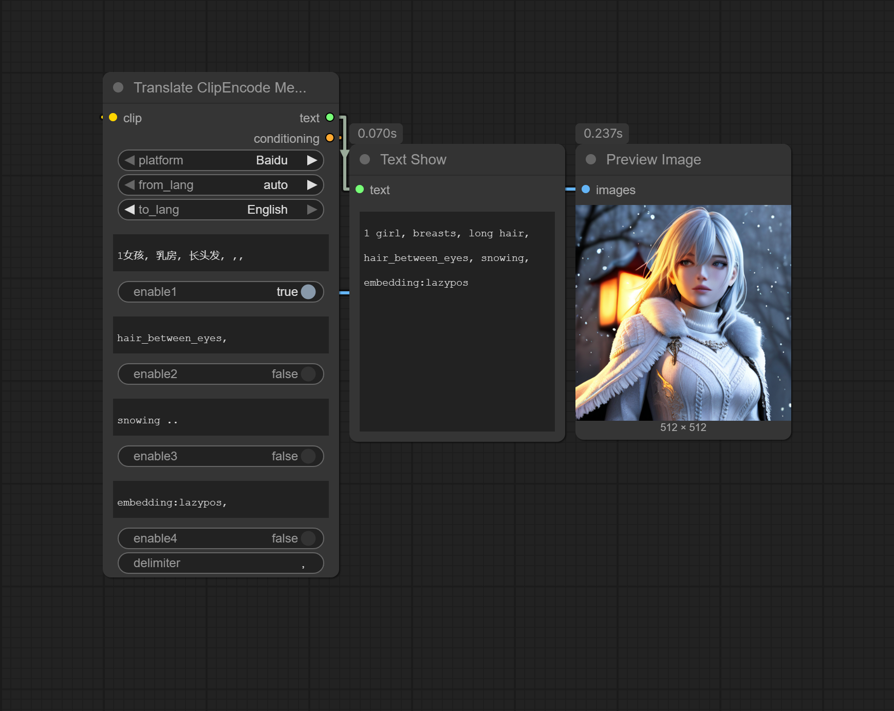

# ComfyUI_A1rSpace
A comfyui custom node package used by myself.

## Introduce
### Control Nodes:
* Seed Control  
"Manual random" can queue a random seed, have 2.5s cd.  
"Pull last seed" can pull and queue the last one seed from the history.  


### KSampler:
* KSampler (A1rSpace)  
Add a button to control the behavior of KSampler. This control button is my core feature.  
The different is that the sampler and scheduler are divided.  
  


### Image node:
* Save/Preview Image  
Just as its name. You can save the image or preview it. Trun on the button to save it.  


### Upscale nodes:
* Image Upscale Switch (Toggled)  
Combine the Offical Image Upscale node. Switch, Control.  
  


* Latex UpscaleBy (Toggled)  
Add a control button.  
  


### Text nodes:
* Text Show  
Provide a frame to display inputs texts. Have a copy button.  


* Text Box  
Just a text enter box.  


* Text Merge  
Merge the text using the specified separator.  
It can automatically remove extra punctuation at the end of each box before merging them.  


* TextMerge withClipEncode  
base on TextMerge, but with clip encode.  


* Text Translate  
Translate the text using Baidu or Deepseek API.  
Have a button to enable/disable the translation.  
Just EN<->ZH.  
Allow empty input.  
There is their api website:  
Baidu: [https://api.fanyi.baidu.com/manage/developer]  
Deepseek: [https://platform.deepseek.com/api_keys]  
Deepseek will more professional but paid.  
  


* Translate ClipEncode Merge  
Combine Merge, CLIP Encode and Translate.  


* JoyTag Text Box  
A text box with JoyTag.  
It will output the text directly by disable 'apply_tag' button.  
Needs JoyTag model.  
Required files "model.safetensors", "config.json", "top_tags.txt".  
Put them in to `ComfyUI\models\joytag`.  
Node will dowload them automatically if not found.  
You can also manually download them from [https://huggingface.co/fancyfeast/joytag/tree/main]. (The model.onnx file does not need to be downloaded)  
  


## Installation and Update
### Installation:
* Clone the repo into the custom_nodes directory and install the requirements:
  ```
  git clone https://github.com/A1rCHAN/ComfyUI_A1rSpace.git
  ```
* Install dependencies in your Python environment.
  * For Windows Portable, run the following command inside `ComfyUI\custom_nodes\ComfyUI_A1rSpace`:
    ```
    ..\..\..\python_embeded\python.exe -m pip install -r requirements.txt
    ```
  * If your ComfyUI venv inside `ComfyUI\.venv\Scripts\python.exe`:
    ```
    ..\..\.venv\Scripts\python.exe -m pip install -r requirements.txt
    ```
  * For using venv or conda, activate your Python environment first, then run:
    ```
    pip install -r requirements.txt
    ```

### Update:
* Inside `ComfyUI\custom_nodes\ComfyUI_A1rSpace`:
  ```
  git pull
  ```
### Update history
- version 1.0.5:  
  Fixed 'Text Merge', 'TextMerge withClipEncode', 'Translate ClipEncode Merge' clean_text function.  
  Now they can correctly clean up the extra punctuation at the end of the text.  
  Update some nodes introduce. More introductions will be updated in the future.
- version 1.0.4:  
  Enhance 'seed control' node, fix other nodes bugs. complete all nodes almostly.
- version 1.0.3:  
  Optimize 'slider custom' & 'boolean to int' front-end experience, enhance 'size fixer', debug utils nodes.
- version 1.0.2:  
  Fixed collapse outputs function and other bugs, can work normally now.
- version 1.0.1:  
  Demo version
- version 1.0.0:  
  Push project

## Plan TODO:
1. Improve front interaction.
2. Add and modify more nodes to provide complete functions.
3. Find and fix bugs.
4. Language support with Chinese.
